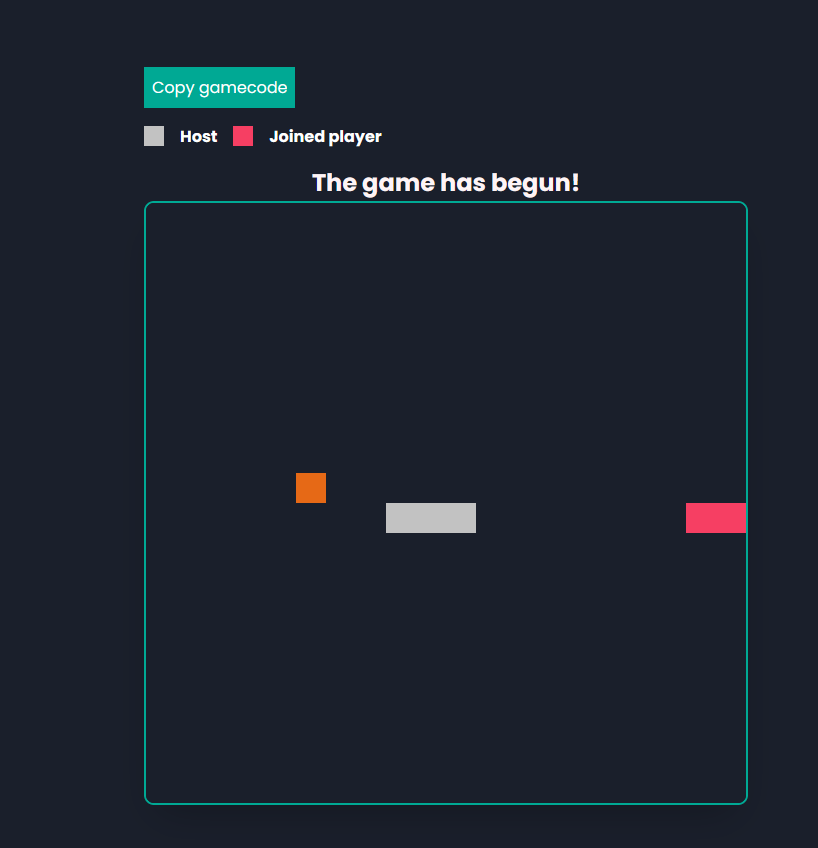

### Multiplayer snake game

> [Made for Real-Time Web](https://github.com/cmda-minor-web/real-time-web-2021)

**Important note: You might have to lower your sound before playing a game :)**

### App description

Snake is the common name for a video game concept where the player maneuvers a line which grows in length, with the line itself being a primary obstacle. The concept originated in the 1976 arcade game Blockade, and the ease of implementing Snake has led to hundreds of versions (some of which have the word snake or worm in the title) for many platforms.

The player who goes out of the grid loses, also if there a collision between the two players, the player who caused the collision loses the match

### Live demo:

[Multiplayer snake](https://realtime-web.herokuapp.com/)

### :pushpin: Table of contents

- [Concepts](#Concept-&-sketches)
- [Chosen concept](#Chosen-concept)
- [What does this app do?](#What-does-this-app-do)
- [Wishlist](#Wishlist)
- [Real-time events](#Real-time-events)
- [Data flowchart](#snake-data-flowchart)
- [Used packages](#Used-packages)
- [Install the app](#Install-the-application)
- [Sources](#Sources)

### Concept & sketches

#### Realtime twitter tweets

Getting realtime twitter tweets with filters, so if i setup a filter to retrieve tweets with the hashtags: programming, I will only receive these in my overview which I can also archive or save it into the database.

#### Multiplayer snake game

2 players will battle each other in a snake battle, This game allows multiple users to control their own snake, the best snake that survives the longest, wins the game. The player can choose to make a new room or invite friends into their room.

### Chosen concept

The concept that I've chosen is: Multiplayer snake game

### What does this app do

- Create room
- Join room (with gamecode)
- Detects how many players are in the room
- Copy gamecode
- Play a harder version of snake
- Plays music during the match (Doom :fire:)
- Detects if player goes out of grid
- Detects if there is any collision between the players
- Supports 2 players at a time
- Supports seperate rooms

### Wishlist

#### Must haves
- [x] Create room for players to join the game
- [x] Other player is able to join the room
- [x] Player is able to see their gamecode and send invite link
- [x] In each game there is a winner
- [x] Snake food is begin generated in the grid

#### Should haves

- [x] Match has a countdown before the game begins
- [x] Setup database for scores/time
- [ ] Choose snake color
- [ ] Choose game theme
- [ ] Change models

### Real-time events

New game

> Makes a new game room with a unique ID for the players to play in that room

Join game

> Join the game with a unique code, the server checks if this is a valid code or not

Keydown

> Every button presses (arrows) are being captured and sent the server, to calculate the new position of the snake

emitGameState

> Check if the game already started or not

emitGameover

> If the game is over, return the winner of the game

### snake data flowchart 

### Used packages

[dotenv](https://www.npmjs.com/package/dotenv) : 

Dotenv is a zero-dependency module that loads environment variables from a .env file into process.env. Storing configuration in the environment separate from code is based on The Twelve-Factor App methodology.

[ejs](https://www.npmjs.com/package/ejs) : 

Embedded JavaScript templates

[express](https://www.npmjs.com/package/express) :

Fast, unopinionated, minimalist web framework for node.

[express-router](https://www.npmjs.com/package/express-router) : 

express-router lets you write your express routes in a simpler way. You just have to create a 'routes' folder inside your project and place your routes in an index.txt file.

[nodemon](https://www.npmjs.com/package/nodemon)

nodemon is a tool that helps develop node.js based applications by automatically restarting the node application when file changes in the directory are detected.

[socket.io](https://www.npmjs.com/package/socket.io)

Socket io enables real-time bidirectional event-based communication

[firebase](https://www.npmjs.com/package/firebase)

Firebase provides the tools and infrastructure you need to develop, grow, and earn money from your app. This package supports web (browser), mobile-web, and server (Node.js) clients.

[uuidv4](https://www.npmjs.com/package/uuidv4)

uuidv4 creates v4 UUIDs

### Install the application

#### Clone the repository

> git clone https://github.com/RowinRuizendaal/Multiplayer-Snake.git

Cd to the multiplayer snake game directory and:

> NPM install

or install it with yarn:

> Yarn install

Once you have installed the project, execute the following command within your code editor:

> npm run dev

### Sources

Chris DeLeon of HomeTeam GameDev. (2017, May 5). Coding “Snake” in 4 min 30 sec (plain browser JavaScript). YouTube. https://www.youtube.com/watch?v=xGmXxpIj6vs

Create a Copy Button Without an Input Text Box. (2018, June 11). Stack Overflow. https://stackoverflow.com/questions/50795042/create-a-copy-button-without-an-input-text-box/50795833

E. (n.d.). JavaScript Snake Game Tutorial: build a simple, interactive game. Educative: Interactive Courses for Software Developers. https://www.educative.io/blog/javascript-snake-game-tutorial

Get started. (2021, April 19). Socket.IO. https://socket.io/get-started/chat

how to get socket.io number of clients in room? (2015, July 17). Stack Overflow. https://stackoverflow.com/questions/31468473/how-to-get-socket-io-number-of-clients-in-room

npm: dotenv. (2019, October 16). Npm. https://www.npmjs.com/package/dotenv

npm: ejs. (2021, February 6). Npm. https://www.npmjs.com/package/ejs

npm: express. (2019, May 26). Npm. https://www.npmjs.com/package/express

npm: express-router. (2012, August 24). Npm. https://www.npmjs.com/package/express-router

npm: firebase. (2021, April 13). Npm. https://www.npmjs.com/package/firebase

npm: nodemon. (2021, January 6). Npm. https://www.npmjs.com/package/nodemon

npm: socket.io. (2021, April 1). Npm. https://www.npmjs.com/package/socket.io

npm: uuidv4. (2021, March 25). Npm. https://www.npmjs.com/package/uuidv4

Perform simple and compound queries in Cloud Firestore |. (n.d.). Firebase. Retrieved April 23, 2021, from https://firebase.google.com/docs/firestore/query-data/queries#node.js

### Shoutout

[vuurvos1](https://github.com/vuurvos1) :

> Helping me with Math logic

